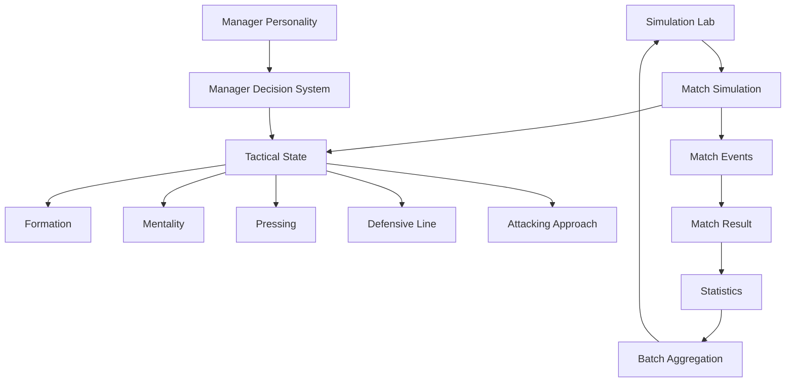
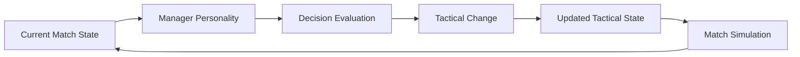
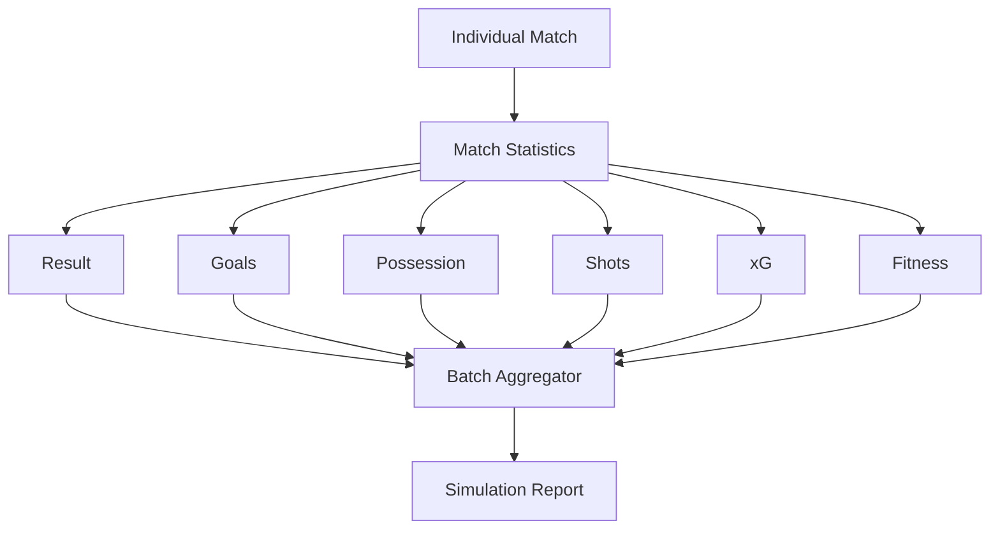

# Architecture

## Football Tactical Simulation Engine

The project is organised around four major concerns:

1. Match simulation
2. Tactical state
3. Manager decision-making
4. Automated experimentation

## High-Level Architecture



## Simulation Lab

The Simulation Lab is the experimental harness around the match simulation. It selects configurations, runs repeated matches, aggregates results and prints comparable statistics.

The current tests use **1,000 matches per configuration**.

## Tactical State

The tactical model currently includes:

```text
Formation
Mentality
Pressing
Defensive Line
Attacking Approach
Manager Personality
```

These systems are intended to interact. For example:

```text
Formation + Attacking Approach + Manager Personality
                    ↓
            Tactical behaviour
                    ↓
             Match outcomes
```

## Manager Decision System

Manager personalities currently include:

```text
Balanced
Possession
Gegenpress
CounterAttack
Pragmatic
Direct
```

The system records tactical changes, including mentality, pressing, defensive line and formation changes, as well as decisions by match period.



## Statistics Pipeline



## Experimental Design

Current focused experiments include:

- Formation comparison
- Mentality comparison
- Pressing comparison
- Defensive-line comparison
- Formation/attacking-style matrix
- Manager personality comparison

## Design Principles

### Data-driven evaluation
Repeated simulation is used to compare tactical behaviour rather than relying on a single match.

### Interacting systems
The project is designed so tactical dimensions can influence one another.

### Separation of concerns
The match simulation produces outcomes while the Simulation Lab is responsible for experimentation and aggregation.

### Extensibility
The tactical model is organised so additional dimensions can be added without redesigning the experiment layer.

## Current Limitations

The portfolio prototype does not fully model player-level roles, opponent-specific adaptation, squad attributes, home/away effects or formal statistical significance testing.

## Portfolio Takeaway

The core engineering loop is:

**Simulation → Decision Systems → Tactical State → Match Statistics → Automated Experimentation**
