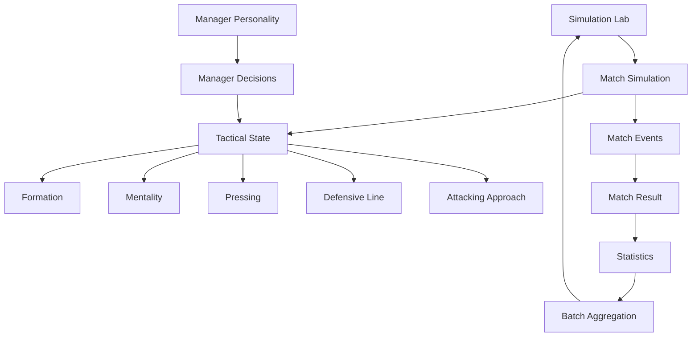

# Football Tactical Simulation Engine

A data-driven football tactics and match simulation project built in **Unity and C#**.

The project explores how formations, mentality, pressing intensity, defensive line, attacking approach and manager personality influence simulated match outcomes. An automated **Simulation Lab** runs repeated matches and compares results using win rate, goals, possession, shots, expected goals (xG) and fitness.

> **Status:** Portfolio / completed simulation prototype

## Highlights

- Football match simulation in Unity/C#
- Tactical modelling across multiple systems
- Automated batch simulation and statistical comparison
- Simulation Lab for repeated match experiments
- Win rate, goals, possession, shots, xG and fitness metrics
- Manager personality and tactical decision-making
- Tactical interactions between formations and attacking approaches

## Tactical Systems

| System | Options tested |
|---|---|
| Formation | 4-4-2, 4-3-3, 4-2-3-1 |
| Mentality | Defensive, Balanced, Attacking |
| Pressing | Low, Medium, High |
| Defensive line | Deep, Normal, High |
| Attacking approach | Possession, Wide Attack, Direct |
| Manager personality | Balanced, Possession, Gegenpress, CounterAttack, Pragmatic, Direct |

## Simulation Lab

The Simulation Lab automates repeated matches and aggregates comparable statistics. The current batch suite uses **1,000 matches per test**.

Example:

```text
FORMATION: 4-3-3
Matches:        1000
Wins:           404
Draws:          246
Losses:         350
Win Rate:       40.4%
Avg Goals:      1.91
Avg Possession: 52.1%
Avg Shots:      11.78
Avg xG:         1.90
Avg Fitness:    60.7%
```

## Selected Results

### Formation

| Formation | Win Rate | Goals | Possession | Shots | xG |
|---|---:|---:|---:|---:|---:|
| 4-4-2 | 37.8% | 1.80 | 51.8% | 11.51 | 1.83 |
| **4-3-3** | **40.4%** | **1.91** | 52.1% | 11.78 | 1.90 |
| 4-2-3-1 | 36.7% | 1.82 | **52.7%** | 11.62 | 1.86 |

### Pressing

| Pressing | Win Rate | Goals | xG | Fitness |
|---|---:|---:|---:|---:|
| Low | 39.0% | 1.83 | 1.87 | **72.1%** |
| **Medium** | **43.1%** | 1.97 | 1.90 | 60.7% |
| High | 41.1% | **2.03** | **2.00** | 52.9% |

### Defensive Line

| Line | Win Rate | Goals | Possession | xG |
|---|---:|---:|---:|---:|
| Deep | 37.2% | 1.85 | 50.7% | 1.86 |
| Normal | 39.1% | 1.85 | 52.1% | 1.86 |
| **High** | **41.4%** | **1.99** | **53.5%** | **1.95** |

### Manager Personality

| Personality | Win Rate | Goals | xG | Fitness |
|---|---:|---:|---:|---:|
| Balanced | 39.5% | 1.84 | 1.94 | 60.7% |
| Possession | 41.2% | 1.96 | 1.99 | 54.1% |
| **Gegenpress** | **45.3%** | **2.25** | **2.23** | 53.9% |
| CounterAttack | 40.2% | 1.78 | 1.79 | **65.6%** |
| Pragmatic | 39.2% | 1.86 | 1.85 | **65.1%** |
| Direct | 42.6% | 2.08 | 1.97 | 60.6% |

## Tactical Interaction

One useful finding was the difference between an isolated formation test and a formation combined with an attacking approach.

| Configuration | Win Rate | Goals | Possession | Shots | xG |
|---|---:|---:|---:|---:|---:|
| 4-2-3-1 alone | 36.7% | 1.82 | 52.7% | 11.62 | 1.86 |
| 4-2-3-1 + Direct | 42.8% | 1.96 | 51.8% | 11.73 | 1.90 |
| **4-2-3-1 + Possession** | **47.0%** | **2.07** | **55.6%** | **12.74** | **2.07** |

This supports the design goal of modelling tactics as **interacting systems** rather than assigning a fixed universal strength to each formation.

## Manager Decision Behaviour

Manager personality also records tactical changes and decisions by match period.

Example Gegenpress output:

```text
Behaviour | Changes 3.00 | Mentality 0.73 | Pressing 0.89 | Defensive Line 0.89 | Formation 0.49
Decisions | Total 9.74 | 0-30 2.85 | 31-60 3.47 | 61-90 3.42
```

## Architecture

See [`ARCHITECTURE.md`](ARCHITECTURE.md).



## Technical Focus

- C#
- Unity
- Object-oriented programming
- Simulation design
- State-driven systems
- Tactical AI / decision-making
- Behaviour modelling
- Automated experimentation
- Statistical aggregation
- Data-driven gameplay systems

## Performance

The complete current batch test suite completed in approximately **48.2 seconds**.

## Limitations

This is a simulation prototype, not a complete football management game or a validated predictor of real-world football results. Results describe the behaviour of the implemented simulation model.

## Future Work

Possible extensions include opponent-specific adaptation, player/squad attributes, home/away effects, more detailed event modelling, statistical confidence intervals and visual analytics. These are not claims about the current implementation.

## Repository Structure

```text
FootballTacticalSimulation/
├── Assets/
│   └── Scripts/
├── Packages/
├── ProjectSettings/
├── README.md
├── ARCHITECTURE.md
├── CV.md
├── .gitignore
└── LICENSE
```
